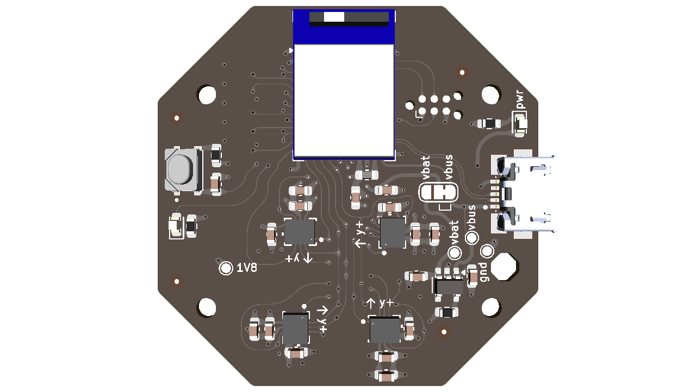

# IMU Array Development Board

## Overview

The IMU Array Development Board (imu-array-dev) is a feature-rich platform designed for testing, development, and evaluation of multi-IMU applications using the ICM-42670-P 6-axis MEMS motion tracking device from TDK InvenSense.

## Key Features

### IMU Sensors
- **8x ICM-42670-P** 6-axis MEMS motion tracking devices
- High-performance 3-axis gyroscope and 3-axis accelerometer
- Digital motion processing capabilities
- Shared SPI bus with individual interrupt lines
- Individual power and signal control for each sensor
- **Gyroscope Range**: ±250, ±500, ±1000, ±2000 dps
- **Accelerometer Range**: ±2, ±4, ±8, ±16 g

### Wireless Connectivity
- **Nordic MDBT50Q** Bluetooth 5.0/5.1/5.2 module
- Thread and Zigbee support
- Low power wireless communication
- Integrated antenna

### Power Management
- **MCP73812T** Li-Ion/Li-Polymer battery charger
- USB power input via micro-USB connector
- Power regulation and distribution
- Battery charging indication LEDs

### Interface & Control
- Micro-USB connector for power and data
- Reset button (PTS810 tactile switch)
- Status indication LEDs
- Multiple power supply rails (1.8V, 3.3V)

## Technical Specifications

### Power Supply
- **Input Voltage**: 5V via USB
- **Operating Voltage**: 3.3V/1.8V regulated
- **Battery Support**: Li-Ion/Li-Polymer via integrated charger
- **Power Consumption**: Ultra-low power design optimized for battery operation

#### Individual Power Consumption
- **ICM-42670-P (Single)**: 0.55mA (active), 3.5µA (sleep)
- **Nordic MDBT50Q**: Variable based on wireless activity

### IMU Specifications (ICM-42670-P)
- **Gyroscope Range**: ±250, ±500, ±1000, ±2000 dps
- **Accelerometer Range**: ±2, ±4, ±8, ±16 g
- **Operating Temperature**: -40°C to +85°C
- **Interface**: SPI/I2C (configurable)
- **Package**: 14-pin LGA (2.5mm × 3.0mm × 0.76mm)
- **Interrupt Configuration**: Individual interrupt lines for each sensor

### Connectivity
- **Wireless**: Bluetooth 5.x, Thread, Zigbee
- **Wired**: USB 2.0 via micro-USB
- **Protocols**: SPI, I2C for sensor communication

## Operating Conditions

- **Temperature Range**: -40°C to +85°C
- **Humidity Range**: 0% to 100% (non-condensing)

- Development platform for IMU81 Array Module integration
