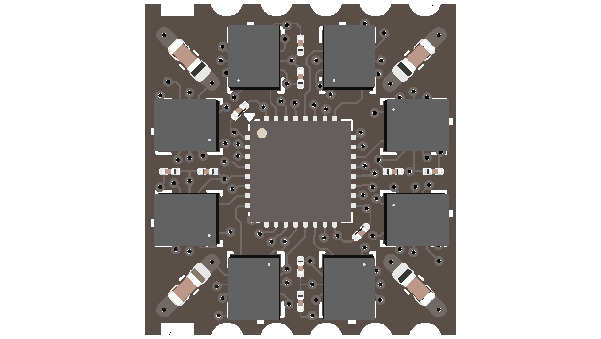

# IMU81 Array Module

<div align="center">

</div>

## Overview

A compact 8-sensor IMU array module featuring ICM-42670-P sensors with STM32 microcontroller for high-performance and very high-accuracy motion sensing applications.

## Key Features

### IMU Sensors

- **8x ICM-42670-P** 6-axis MEMS motion tracking devices
- High-performance 3-axis gyroscope and 3-axis accelerometer  
- Shared SPI bus with individual interrupt lines
- **Gyroscope Range**: ±250, ±500, ±1000, ±2000 dps
- **Accelerometer Range**: ±2, ±4, ±8, ±16 g

### Microcontroller

- **STM32U031K8** ARM Cortex-M0+ ultra-low-power MCU
- 64KB Flash memory, 12KB SRAM
- Ultra-low power consumption

### Interface & Connectivity

- **Dual 6-pin headers** for external connections
- SPI interface for sensor communication
- I2C/UART interface for external communication
- One interrupt line for the host
- Interrupt signals from all 8 IMU sensors

## Technical Specifications

### Dimensions

- **Size**: 16mm x 17mm
- **Weight**: 5g

### Power Supply

- **Operating Voltage**: 1.8V - 3.3V
- **Power Consumption**: Ultra-low power design optimized for battery operation

#### Individual Power Consumption

- **ICM-42670-P (Single)**: 0.55mA (active), 3.5µA (sleep)
- **STM32U031K8**: 4mA (active), 16nA (sleep)

## Operating Conditions

- **Temperature Range**: -40°C to +85°C
- **Humidity Range**: 0% to 100% (non-condensing)

## How To Build

To generate fabrication artifacts make sure you have [Docker](https://www.docker.com/) installed and running.

Then simply run;

```bash
make build
```

from the project root. This will generate an `output` directory containing the fabrication artifacts in the parent directory.